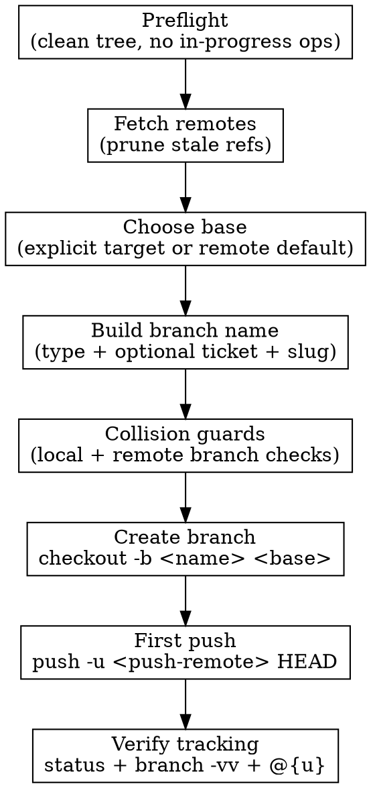

# Creating Branch

Create new branches in a repeatable, low-friction way.

**Default stance:**
- create with `git checkout -b`
- base from a remote ref (remote default branch or an explicitly requested target branch), never local `main`
- first push sets upstream with `git push -u`

## Workflow



## 1) Preflight (required)

```bash
git status --short
```

If output is not empty, stop and ask whether to stash/commit first.

Also stop if any operation is already in progress:
- merge
- rebase
- cherry-pick
- revert

## 2) Fetch remotes and choose base

```bash
git fetch --all --prune
```

Base selection rule:
1. If the work should target a specific branch (release branch, stacked PR parent, etc.), use that explicit base.
2. Otherwise resolve the remote default branch dynamically.

Example resolution:

```bash
if BASE=$(git symbolic-ref --quiet --short refs/remotes/upstream/HEAD 2>/dev/null); then
  :
elif BASE=$(git symbolic-ref --quiet --short refs/remotes/origin/HEAD 2>/dev/null); then
  :
else
  echo "Could not determine remote default branch; ask for explicit base." >&2
  exit 1
fi
printf '%s\n' "$BASE"
```

Never branch from local `main`.

## 3) Branch naming convention

Supported prefixes:
- `feat`
- `fix`
- `chore`
- `refactor`
- `docs`

Preferred patterns:
- With ticket: `<type>/<ticket>-<slug>`
- Without ticket: `<type>/<slug>`

Rules:
- lowercase kebab-case only
- short, specific, outcome-oriented
- include ticket id when available (e.g. `eng-123`, `abc-45`)

Examples:
- `feat/eng-123-add-branch-skill`
- `fix/eng-212-handle-empty-remote`
- `chore/update-skill-metadata`

## 4) Guard against branch name collisions

```bash
BRANCH_NAME="feat/eng-123-add-branch-skill"
PUSH_REMOTE=$(git config --get remote.pushDefault || echo origin)

if git show-ref --verify --quiet "refs/heads/$BRANCH_NAME"; then
  echo "Local branch already exists: $BRANCH_NAME" >&2
  exit 1
fi

if git ls-remote --exit-code --heads "$PUSH_REMOTE" "$BRANCH_NAME" >/dev/null 2>&1; then
  echo "Remote branch already exists on $PUSH_REMOTE: $BRANCH_NAME" >&2
  exit 1
fi
```

## 5) Create branch (`-b` style)

```bash
git checkout -b "$BRANCH_NAME" --no-track "$BASE"
```

`--no-track` prevents Git from auto-setting upstream to the base branch. Without it, checking out from a remote-tracking ref (e.g. `origin/main`) silently tracks that base branch until the first push; plain `git pull` in that window pulls from the base, and prompts display the mismatch (e.g. `feature/foo:main`).

## 6) Set upstream tracking on first push

```bash
git push -u "$PUSH_REMOTE" HEAD
```

After this, plain `git push` works for this branch.

For sync/update, follow the repo’s normal pull/rebase policy.

## 7) Verify branch wiring

```bash
git status -sb
git branch -vv
git rev-parse --abbrev-ref --symbolic-full-name @{u}
```

Expected:
- current branch is your new branch
- upstream exists and points to `<push-remote>/<branch-name>`

## Common mistakes

- Branching from stale local `main`
- Skipping `git fetch --all --prune`
- Omitting `--no-track` when branching from a remote ref (silently auto-tracks the base branch)
- Forgetting `-u` on first push
- Vague names like `fix-stuff` or `wip`
- Reusing an existing local/remote branch name unintentionally
- Auto-rebasing immediately after push rejection instead of stopping to choose a strategy

## Quick reference

```bash
git status --short
git fetch --all --prune

if BASE=$(git symbolic-ref --quiet --short refs/remotes/upstream/HEAD 2>/dev/null); then :;
elif BASE=$(git symbolic-ref --quiet --short refs/remotes/origin/HEAD 2>/dev/null); then :;
else echo "Could not determine base branch" >&2; exit 1; fi

BRANCH_NAME="feat/eng-123-add-branch-skill"
PUSH_REMOTE=$(git config --get remote.pushDefault || echo origin)

git checkout -b "$BRANCH_NAME" --no-track "$BASE"
git push -u "$PUSH_REMOTE" HEAD
git branch -vv
```
